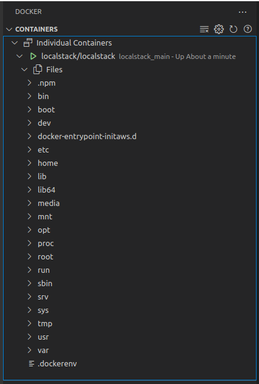
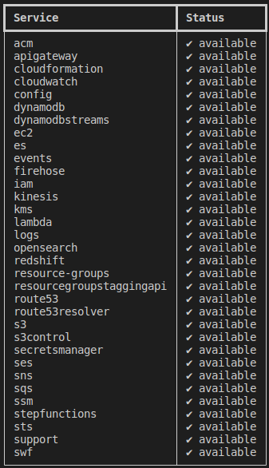

# AWS LocalStack

### Requirements

>python (Python 3.6 up to 3.9 supported) 
pip (Python package manager) 
Docker](https://github.com/rprojetos/dockerLinuxInstall) - Install Docker in the Linux.

### Installing
The easiest way to install LocalStack is via pip:

>pip3 install localstack

### Start LocalStack:

>localstack start -d

Running Container Docker [`localstack`] 

You can query the status of respective services on LocalStack by running:

>localstack status services

# Reference:

[LocalStack](https://github.com/localstack/localstack) - A fully functional local cloud stack.

